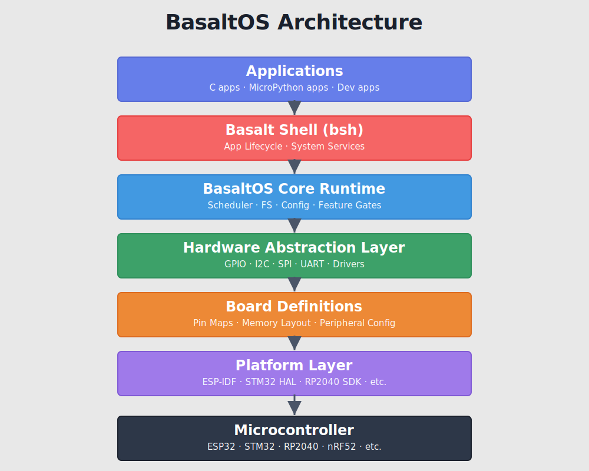

# BasaltOS
[](https://github.com/homer1013/BasaltOS/actions/workflows/configurator-ci.yml)
[](https://github.com/sponsors/homer1013)

BasaltOS is a lightweight, portable embedded OS / application platform aimed at making **small hardware projects feel like installing and running apps**—even for non-engineers.

The long-term goal is an “Android-light” experience on microcontrollers: a friendly shell, installable apps, stable APIs, and a configuration system that scales from quick prototypes to real products.

## Start Here

Choose one path and get to first boot fast:

1. **CLI Wizard path (recommended for deterministic setup)**
   - `python tools/configure.py --wizard`
   - Follow 4 steps: board -> drivers -> runtime options -> generate
2. **Web Configurator path (same flow, easier UX)**
   - `python tools/basaltos_config_server.py`
   - Open `http://localhost:5000`
   - Follow the same 4-step flow as CLI wizard

For complete ESP32 bring-up commands, use:
- `docs/ESP32_FIRST_SUCCESS_10_MIN.md`

## Runtime Model (Important)

BasaltOS is a **multi-runtime platform**, not a single-language wrapper.

- **MicroPython**: integrated and active today for runtime app execution
- **Lua track**: active integration path (bindings contracts, guardrails, CI lane, sample fixtures), with VM/runtime bring-up still being completed
- **Native/C path**: core platform services and HAL remain native-first

This means BasaltOS runtime decisions are architecture-level, not “MicroPython only”.

Apache 2.0 Licensed.

Copyright © 2026 Homer Morrill

---

## Why BasaltOS?

Traditional embedded development ties applications tightly to specific boards and SDKs.

BasaltOS separates:

Platform -> Board -> Drivers -> Apps

You configure once.
You build anywhere.

BasaltOS generates board-aware configuration, feature flags, and SDK defaults so the same app logic can move between ESP32, RP2040, STM32, AVR, PIC, and more.

## What Makes It Different?

- Board taxonomy system (Manufacturer -> Architecture -> Family -> Silicon -> Board)
- CLI + Web configuration generator
- Multi-runtime architecture (MicroPython + Lua track)
- Shell (`bsh`) over UART + TFT
- Filesystem-backed installable app model
- Hardware abstraction layer (HAL)
- Multi-target backend groundwork

## Configurator UX Contract

Both configurators are intended to behave the same way:

1. **Platform & Board**
   - Taxonomy filters, board search, and board capability context
2. **Drivers**
   - Essential/advanced/experimental visibility + validation feedback
3. **Runtime Options**
   - Starter applets + market apps, with optional advanced pin overrides
4. **Generate**
   - Summary, validation report, preview output, and build/flash next steps

The web configurator should be a better-looking, easier-to-scan version of the CLI wizard, not a different product flow.

BasaltOS bridges the gap between:
- Arduino-style firmware
- FreeRTOS-style embedded systems
- Linux-style application platforms

## Quick Start (10 Minutes)

1. Open: `docs/ESP32_FIRST_SUCCESS_10_MIN.md`
2. Plug in your board
3. Run the commands
4. Open the serial console

If it fails, open an issue with:
- board name
- OS
- full error output

## Current Stable Release

`v0.1.1`  
https://github.com/homer1013/BasaltOS/releases/tag/v0.1.1

## Config Flow

User Selects:
Platform -> Board -> Drivers -> Features

           v

`tools/configure.py`  
or  
Web Configurator

           v

Generates:
- `basalt_config.h`
- `basalt.features.json`
- `sdkconfig.defaults`

           v

Build System  
           v
Firmware Image

## Architecture Diagram



## Why Not Arduino, FreeRTOS, or Zephyr?

BasaltOS does not replace these platforms.  
It occupies a different layer in the embedded ecosystem.

### Why Not Arduino?

Arduino is fantastic for:
- Quick prototypes
- Learning embedded basics
- Simple hardware sketches

But Arduino typically:
- Couples applications tightly to board-specific APIs
- Encourages monolithic firmware structure
- Has no built-in app lifecycle or installable app model
- Lacks a structured multi-board configuration abstraction

BasaltOS instead focuses on:
- Separating Platform -> Board -> Drivers -> Apps
- Structured configuration generation
- Installable / runnable app concepts
- A portable hardware abstraction layer

Arduino is firmware-first.  
BasaltOS is platform-first.

### Why Not FreeRTOS?

FreeRTOS provides:
- A lightweight real-time scheduler
- Deterministic task management
- Excellent low-level control

But FreeRTOS is:
- A kernel, not a full application platform
- SDK-dependent (ESP-IDF, STM32Cube, etc.)
- Lacking board taxonomy and feature configuration layers
- Not focused on app install/remove workflows

BasaltOS can run on top of environments that use FreeRTOS internally.

FreeRTOS manages tasks.  
BasaltOS manages systems.

### Why Not Zephyr?

Zephyr offers:
- Industrial-grade RTOS
- Extensive hardware support
- Strong community and vendor backing
- Devicetree-based configuration

But Zephyr is:
- Complex to onboard for newcomers
- Primarily C-centric
- Geared toward production firmware and certification paths
- Not focused on installable app ecosystems or shell-driven workflows

BasaltOS emphasizes:
- Approachability
- Clear board taxonomy
- Installable app model
- Multi-runtime design (not single-language locked)
- Simpler mental model for experimentation and education

Zephyr is production infrastructure.  
BasaltOS is an application platform.

| Platform | Focus                                  |
| -------- | -------------------------------------- |
| Arduino  | Fast firmware prototyping              |
| FreeRTOS | Real-time task scheduling              |
| Zephyr   | Industrial RTOS ecosystem              |
| BasaltOS | Portable embedded application platform |

---

## What Works Today

What’s working today:

- **Basalt Shell (`bsh`)** over UART + TFT console output
  - `help -commands` with clearer usage text
  - improved path handling (`cd`, virtual roots, app/dev roots)
  - app commands: `run`, `run_dev`, `stop`, `kill`, `apps`, `apps_dev`
  - diagnostics: `led_test`, `devcheck`, `drivers`
- **Filesystem support**
  - SPIFFS internal flash (“storage” partition baked from `spiffs/`)
  - Optional SD card filesystem (board/driver dependent)
- **App lifecycle (early)**
  - install/run/remove concepts
  - “store-only zip” packaging tools (`tools/pack_app.py`)
  - dev app workflow under `dev/apps_dev` with shell execution via `run_dev`
- **Runtime architecture (multi-runtime)**
  - BasaltOS runtime dispatch supports per-app runtime selection (for example: `python`, `lua`, `native`)
  - MicroPython runtime is integrated today with expanding `basalt.*` APIs
  - Lua runtime path is active with component scaffolding, bindings contracts, guardrails, CI lane, and sample/parity fixtures
  - Lua VM/runtime integration is intentionally staged and still in progress for production execution
  - UI API currently includes draw + touch primitives used by apps like `paint` in MicroPython
- **Configuration system (CLI + Web)**
  - **Boards + Drivers + Platforms** model
  - CLI wizard: `python tools/configure.py --wizard`
  - CLI wizard now starts board-first with taxonomy filters:
    - Manufacturer -> Architecture -> Family -> Processor/Silicon -> Board
  - CLI wizard now includes:
    - compact board picker with board-detail confirmation
    - interactive driver toggle flow (number/id + details)
    - final review/edit/confirm gate before generation
  - Local web configurator: `python tools/basaltos_config_server.py`
  - Web configurator now mirrors wizard flow more strictly:
    - board defaults match CLI driver-default behavior
    - explicit Runtime Options step (starter applets + market apps)
    - pin mapping moved to optional Advanced section
  - generated outputs:
    - `config/generated/basalt_config.h`
    - `config/generated/basalt.features.json`
    - `config/generated/sdkconfig.defaults`
  - ESP-IDF build from repo root (`BasaltOS_Main`), not from `tools/`:
    - `SDKCONFIG_DEFAULTS=config/generated/sdkconfig.defaults idf.py -B build set-target <target>`
    - `SDKCONFIG_DEFAULTS=config/generated/sdkconfig.defaults idf.py -B build build`
- **Multi-target backend groundwork**
  - runtime-capable flow for ESP32/IDF boards
  - generated-firmware profile flow started for constrained targets (PIC/AVR direction)
- **Driver/peripheral expansion**
  - connectivity: `wifi`, `bluetooth`, `twai` (CAN)
  - transceiver + motor: `mcp2544fd`, `uln2003`, `l298n`
  - sensing/display gates: `display_ssd1306`, `rtc`, `imu`, `dht22`, `mic`, `ads1115`, `mcp23017`, `hp4067`, `tp4056`
  - SSD1306 hardware validation complete on ESP32-C3 SuperMini (I2C defaults `SDA=GPIO8`, `SCL=GPIO9`) for both `128x64` and `128x32` panels at `0x3C`

---

## Project Philosophy

BasaltOS is an open-source embedded operating system and application platform designed to make embedded development more modular, approachable, and scalable.

The BasaltOS **core will remain open and free to use**. Development is supported through optional donations and, in the future, hosted tools and commercial offerings built **around** the core, not by restricting access to it.

The goal is to empower experimentation, education, and real-world products without lock-in.

## What Is BasaltOS Core?

BasaltOS Core includes:
- The BasaltOS kernel and runtime
- Hardware Abstraction Layer (HAL)
- Platform ports (e.g. ESP32, AVR)
- Core shell and system services
- Reference applications and examples
- Build system and tooling required to use the core

BasaltOS Core is fully open source and licensed under the Apache License 2.0.

## The BasaltOS Ecosystem

The BasaltOS ecosystem may include:
- Hosted tools (e.g. web flashing, configuration, CI builds)
- Optional commercial services or integrations
- Hardware kits or certified boards
- Educational material and documentation

These components may be offered under separate terms.

## Sponsor BasaltOS

If BasaltOS helps your work, you can support development via:

- GitHub Sponsors: https://github.com/sponsors/homer1013
- Buy Me a Coffee: https://buymeacoffee.com/homer.morrill

Sponsorship helps fund core maintenance, board bring-up, docs, CI time, and release quality work.

---

## Big idea: Configure once, build anywhere

BasaltOS is moving toward a model where you choose:

1. **Platform** (esp32, stm32, rp2040, …)
2. **Board variant** (specific devkit/module/display/etc.)
3. **Drivers / features** (spi, uart, tft, filesystem, …)

…and BasaltOS generates:

- `config/generated/basalt_config.h` (compile-time feature switches + board pins)
- `config/generated/sdkconfig.defaults` (ESP-IDF defaults, layered by platform/board)

This is the “backend” that later becomes a GUI (Arduino/CubeMX-style), but it’s already usable today via CLI.

---

## Getting Started (ESP-IDF / ESP32)

Quick path: `docs/ESP32_FIRST_SUCCESS_10_MIN.md`

Before you begin, make sure you have:
- an ESP32 board connected by USB
- Python 3 available in terminal
- ESP-IDF installed (the guide above covers this)

### 1) Clone + init submodules
```bash
git clone https://github.com/homer1013/BasaltOS
cd BasaltOS
git submodule update --init --recursive
```

### 2) Set up ESP-IDF environment
```bash
source tools/env.sh
```

### 3) Configure using the wizard
```bash
python tools/configure.py --wizard
```

This will guide you through:
- board taxonomy filters + board selection (e.g. `cyd_3248s035r`)
- driver selection (e.g. `spi,tft,uart,fs_spiffs`)

…and generate configuration outputs into:
```
config/generated/
```

### 4) Build and flash
```bash
SDKCONFIG_DEFAULTS=config/generated/sdkconfig.defaults idf.py -B build build
idf.py -B build -p /dev/ttyUSB0 flash monitor
```

If `/dev/ttyUSB0` is not your device, replace it with your serial port
(common alternatives: `/dev/ttyACM0`, `COM3`, `COM4`).

### 5) Optional: run the local web configurator
```bash
python tools/basaltos_config_server.py
```

Then open:
```
http://localhost:5000
```

This is intended for local workflow right now (no hosting/deployment required).

## Local Data Workspace

BasaltOS keeps local-only user data and machine-specific cache outside git under a
canonical local workspace root.

- Contract: `docs/LOCAL_DATA_WORKSPACE.md`
- Guest->account sync handoff: `docs/GUEST_SYNC_CONTRACT.md`
- Migration helper:
  - `python3 tools/local_data_migrate.py --dry-run`
  - `python3 tools/local_data_migrate.py --apply`

First-success checkpoint:
- device boots without crash/reset loop
- serial monitor shows shell startup output
- `help` command responds in shell

Third-party app developers should start with:
- `docs/third-party-app-dev.md`
- `docs/api-basalt.md`

App flow in web configurator:
1. Pick platform + board in Configurator
2. Open **App Market** (top nav)
3. Add compatible starter/market apps to current build
4. Generate + Build, then flash

---

## Local dev apps workflow (ESP32 shell)

Dev app examples live in:
```
dev/apps_dev/
```

Typical flow:
1. copy a dev app onto device storage (`/apps_dev`) or SD (`/sd/apps_dev`)
2. from shell, run:
   - `apps_dev`
   - `run_dev <name>`
   - `kill` (to stop a running app)

For hardware sanity checks:
- `led_test` (or `led_test <pin>`)
- `devcheck` / `devcheck full`
- `drivers` (shows enabled drivers and whether runtime support is implemented yet)

Experimental driver note:
- `display_ssd1306`, `rtc`, `imu`, `dht22`, and `mic` are now selectable in the configurator.
- `rtc` now has a basic runtime API in MicroPython: `basalt.rtc.available()` and `basalt.rtc.now()`.
- `display_ssd1306` now has a basic runtime API in MicroPython: `basalt.ssd1306` with draw primitives (`pixel/line/rect/circle/ellipse`) and `show()`.
- `imu`, `dht22`, and `mic` remain **configuration gates + diagnostics** while runtime drivers are implemented incrementally.

Wi-Fi shell examples:
- `wifi status`
- `wifi scan`
- `wifi connect MySSID MyPassphrase`
- `wifi reconnect`
- `wifi disconnect`

Bluetooth shell examples:
- `bluetooth status`
- `bluetooth on`
- `bluetooth scan 5`
- `bluetooth off`

App/runtime examples:
- `apps` (list installed apps)
- `run paint` (interactive paint prototype using `basalt.ui`)

Third-party app dev helpers:
- `python tools/new_app.py my_app --dest apps`
- `python tools/validate_app.py apps/my_app`
- `python tools/pack_app.py apps/my_app dist/my_app.zip`

---

## Repository layout (current)

```
apps/
basalt_hal/
boards/
config/
dev/
docs/
main/
modules/
platforms/
runtime/
targets/
sdk/
spiffs/
tools/
```

---

## Roadmap

Near-term:
- Stabilize and expand `basalt.*` APIs (UI, IO, runtime ergonomics)
- Continue shell UX polish and command safety
- Harden driver gating + board capability constraints
- Complete board metadata (pins, flash/ram, LED mode/polarity, driver support)
- Expand App Market metadata/signing and moderation workflow

Mid-term:
- Full-featured configurator UX (validation, conflict hints, profile export/import)
- Better generated-project outputs for non-runtime targets
- Repeatable saved configurations and build profiles

Long-term:
- Stable SDK feel
- Signed packages and permissions
- Full Lua runtime integration + parity with MicroPython-facing Basalt APIs
- Hosted configurator + broader target support

---

## Contributing

If you’re new to the repo:
1. Run `python tools/configure.py --wizard`
2. Build and flash for your board
3. Open an issue with platform, board, and logs

## Contracts

See `CONTRACTS.md` and `docs/RELEASE_SYNC_CHECKLIST.md` for cross-repo ownership and release sync rules.
